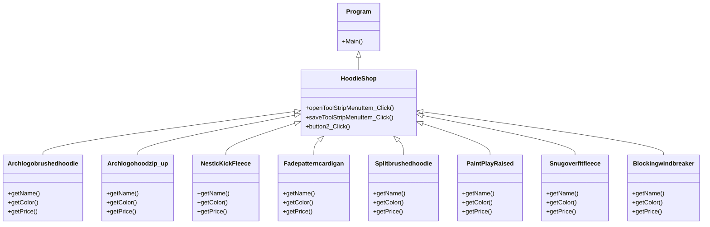

# FinalProject

### ความเป็นมาของโปรแกรม
=เป็นเพราะว่าร้านขายอุปกปรณ์ที่ใหญ่ๆจะเช็คของหรือสินค้าลำบากและเวลาที่มีรถมาซ่อมเยอะๆจะเก็บข้อมูลวันที่หรือราคาลำบากเลยสร้างแอปที่มาตอบสนอง

### วัตถุประสงค์ของโปรแกรม
=บันทึกข้อมูลของอะไหล์สินค้ารถต่างๆเเละบันทึกการรับซ่อมรถของอู๋ซ่อมรถ

### โครงสร้างของโปรแกรม (Class diagram)

### ชื่อของผู้พัฒนาโปรแกรม
นายวิชญ์พล ยืนยง 653450103-3
